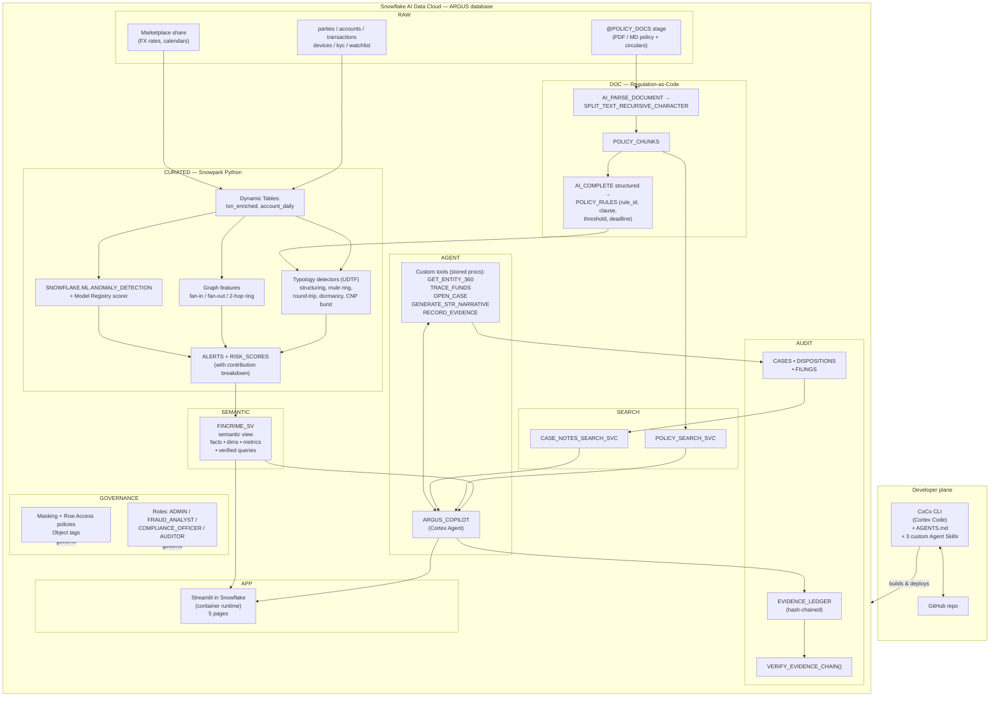
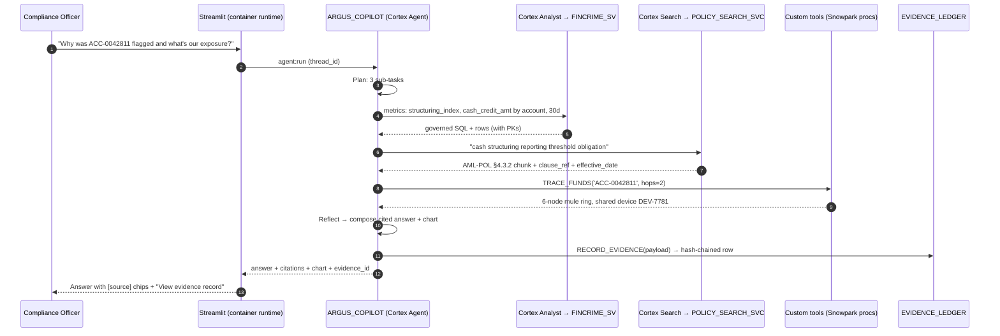

# ARGUS — Audit-Ready Governed Risk & Uncovered-Signal Copilot

> **Snowflake CoCo CLI Hackathon 2026 — Winning Plan & Build Guide**
> Problem Statement **#1 — Risk, Fraud and Regulatory Intelligence Copilot**
> Tagline: **"From signal → evidence → filing. Every number provable. Every claim cited."**

---

## Document map

| Part | Section | What it is |
|---|---|---|
| **A** | [1. Rules that shape the build](#1-rules-that-shape-the-build) | Hard constraints extracted from the official T&C |
| | [2. Why Problem Statement #1](#2-why-problem-statement-1) | Scored comparison of all 5 challenges |
| | [3. The product: ARGUS](#3-the-product-argus) | What we build and why it's differentiated |
| | [4. Winning thesis mapped to the rubric](#4-winning-thesis-mapped-to-the-rubric) | Point-by-point scoring strategy |
| | [5. Architecture](#5-architecture) | Diagrams, layers, object inventory |
| | [6. Data plan](#6-data-plan) | Synthetic data, planted typologies, licences |
| | [7. Scope: MVP vs stretch](#7-scope-mvp-vs-stretch) | What must exist to submit |
| | [8. Credit budget & cost guardrails](#8-credit-budget--cost-guardrails) | Protecting the $400 |
| | [9. Risk register](#9-risk-register) | Known traps + mitigations |
| | [10. Deliverables & submission pack](#10-deliverables--submission-pack) | Brief copy, deck outline, video script |
| **B** | [11. The CoCo CLI build guide](#part-b--the-coco-cli-build-guide) | Phase 0–12, copy-paste prompts |
| | [12. Human checkpoint index](#12-human-checkpoint-index) | Everything *you* must do personally |
| | [13. Final pre-submission checklist](#13-final-pre-submission-checklist) | Sign-off gate |

---

# PART A — STRATEGY

## 1. Rules that shape the build

Pulled from the official Terms & Conditions and the event page. These are **binding design constraints**, not suggestions.

### 1.1 Hard requirements (from T&C §9 "Criteria and Selection")

Judges score on these four things. Every one of them is baked into this plan:

| # | Requirement | How ARGUS satisfies it |
|---|---|---|
| 1 | Prototype responsive to a designated theme, **including use of Cortex Code / CoCo CLI** | The *entire* repo is built by CoCo CLI. We ship **custom CoCo CLI Agent Skills** (`.cortex/skills/`) + `AGENTS.md` so CoCo itself becomes part of the product's operating model. The demo video is a CoCo CLI screen recording. |
| 2 | Uses **Python, Java and/or Scala** | Snowpark **Python** everywhere: data generation, feature engineering, UDFs/UDTFs, stored procedures, ML model, Streamlit app. |
| 3 | **Use of Snowflake's platform is required** | 100% Snowflake-native. No external compute, no external LLM API, no external vector DB. |
| 4 | **Special consideration** for Snowpark, Worksheets, Streamlit, Snowflake Marketplace | We use **all four**: Snowpark (heavy), Streamlit in Snowflake (the UI), Worksheets (packaged demo worksheets committed to repo), Marketplace (free listing for FX/entity enrichment). |

### 1.2 Entry requirements (T&C §4)

- ✅ Presentation deck (PDF, ≤5 MB per the form).
- ✅ **Complete public GitHub repo** with clear documentation for judges.
- ✅ Demo video, **3–5 minutes**, showing Input → Processing → Output executed via CoCo CLI, **at least one fully working end-to-end workflow**, and **2–3 modular skills/capabilities** demonstrated.
- ✅ Prototype/MVP Brief ≤1024 characters.
- ✅ **All datasets must be listed** in the Entry, with a licence link/copy for anything not provided by Snowflake → we ship `DATA_SOURCES.md`.
- ✅ Everything in **English**.
- ⚠️ Finalists must do a **live** demo. Pre-recorded not accepted unless approved. → The app must actually run on a fresh account from a single deploy script.
- ⚠️ **One entry per participant/team.** Team size 1–4.

### 1.3 Things that get you disqualified

- Proprietary/confidential data or code you don't have rights to (§4.4e).
- Third-party material whose licence restricts Snowflake's right to display/promote your entry (§4.4c).
- Plagiarism.
- Real customer / real PII data. → **We use 100% synthetic data, generated by our own Snowpark code, with a clear statement in the README.** **Let the user know when you want to generate synthetic data to avoid credit usage on Coco CLI models. User will use his unlimited Copilot 365 subscription to generate the data. Provide the prompt user should use for this generation and place to store the generated data.**

### 1.4 IP

You keep ownership (§7.1), but you grant Snowflake + Hack2skill a **perpetual, irrevocable, sublicensable licence** to use/display/promote the entry (§7.2). Don't put anything in the repo you aren't willing to have publicly showcased forever. Use MIT or Apache-2.0 for the repo.

### 1.5 ⚠️ Timeline discrepancy — resolve this on Day 0

Today is 05 October 2026 and 06 October 2026 is the final day of submission for the PDF, public repo and the demo video. 

### 1.6 ⚠️ Account type and Constraints 

Got $400 dollars worth of Coco CLI usage for this hackathon from Snowflake with models such as Claude Opus, Sonnet, GPT 5.4, Gemini 3.7 Flash, etc., select the most efficient model for each task (or let user know and change it for you) so that the entire project and troubleshooting can be build and done within the credits available. 

---

## 2. Why Problem Statement #1

Scored 1–5 against what the rubric actually rewards (Real-World Relevance 30%, **Technical Execution 40%**, Solution Completeness 30%), plus "can a 1-person team finish it".

| Challenge | Relevance | Tech ceiling | Completability | Demo drama | Crowding risk | **Total** |
|---|---|---|---|---|---|---|
| **#1 Risk, Fraud & Regulatory** | **5** | **5** | 4 | **5** | 3 | **22** |
| #2 Customer 360 / NBA | 4 | 4 | 4 | 3 | **5** (most crowded) | 20 |
| #3 Predictive Maintenance / OEE | 4 | 4 | 3 (needs believable OT streams) | 4 | 2 | 17 |
| #4 Patient/Member 360 | 5 | 4 | 3 (clinical realism is hard to fake well) | 3 | 3 | 18 |
| #5 Supply Chain Ontology | 4 | **5** | 4 | 2 (ontology demos are dry) | 2 | 17 |

**Verdict: #1.** Reasons:

1. **It is the only statement that natively demands the full Snowflake AI stack.** "Combine transaction and account data with policy and filing text" = Semantic Views + Cortex Analyst *and* Cortex Search, fused by a Cortex Agent. That is exactly the architecture Snowflake judges want to see working.
2. **"Governed, explainable, evidence-backed" is a differentiator you can actually build.** Most teams will ship a chatbot over a table. We ship an **immutable, hash-chained Evidence Ledger** — a genuinely novel, demoable artifact. This is where Technical Execution (40%) is won.
3. **"Signal → evidence → documented finding or report" is an end-to-end workflow with a hard, visual output**: a generated Suspicious Transaction Report. Solution Completeness (30%) becomes trivially demonstrable — the demo ends with a PDF a regulator could read.
4. **Fraud demos are dramatic.** A mule ring lighting up on a graph beats a churn score in a 4-minute video.
5. **Snowflake's own GTM narrative for FSI is exactly this.** Judges include Snowflake employees. Aligning to their flagship industry story is free points on Real-World Relevance.

**We also fold in the best idea from #5**: we build a proper **ontology-as-semantic-view** so the same metric resolves identically for a Fraud Analyst, a Compliance Officer and an Auditor. That's a cross-statement strength at zero extra cost.

---

## 3. The product: ARGUS

### 3.1 One-paragraph pitch

> **ARGUS** is a Snowflake-native financial-crime copilot for banks and NBFCs. It fuses transaction, account and KYC data with the institution's AML policy corpus and regulator circulars, then lets a compliance officer ask in plain English: *"Which accounts show structuring behaviour this month, and which policy clause does that breach?"* ARGUS answers with governed numbers from a semantic view, cites the exact policy clause from Cortex Search, shows the fund-flow graph, and — with one instruction — opens a case, drafts the Suspicious Transaction Report narrative, and writes an **immutable, hash-chained evidence record** so the entire chain from raw row → alert → finding → filing can be re-proved to a regulator months later.

### 3.2 The three ideas that make it win

Most hackathon entries stop at "natural language → SQL → chart". ARGUS adds three layers no one else will:

#### Idea 1 — The Evidence Ledger (this is the crown jewel)

Every single agent answer emits a row into `AUDIT.EVIDENCE_LEDGER` containing:

- the question, the resolved intent, the agent thread ID
- **the exact SQL that ran** and the **semantic view + metric names** used
- **the primary keys of every source row** that contributed to the number
- **the document IDs + chunk IDs + clause citations** retrieved
- the model name, the prompt version, the role and warehouse used
- `prev_hash` and `record_hash = SHA2(prev_hash || canonical_payload)`

A `VERIFY_EVIDENCE_CHAIN()` procedure walks the chain and returns `INTACT` / the first tampered sequence number. **In the demo you tamper a row and watch the ledger detect it.** That is a 10-second moment that judges will remember, and it is the literal answer to "audit ready".

> Why this matters: "explainable AI" in most demos means "here's the SQL". ARGUS means *"here is a cryptographically verifiable, reproducible provenance record for a regulatory filing."* That is the difference between a hackathon toy and something a Chief Compliance Officer would sign.

#### Idea 2 — Regulation-as-Code

We don't just RAG over policy PDFs. We run `AI_COMPLETE` with **structured output** over each policy clause and extract a machine-readable obligation:

```
POLICY_RULES(rule_id, source_doc, clause_ref, obligation_text,
             applies_to_entity, trigger_metric, comparator, threshold_value,
             currency, lookback_days, filing_deadline_days, confidence, extracted_at)
```

Our detection jobs then **reference `rule_id`**. So an alert is never "score 0.87" — it is *"AML-POL-2024 §4.3.2: aggregate cash credits ≥ ₹10,00,000 across a 30-day lookback, when individually below the ₹50,000 reporting threshold"*, with the clause text one click away, and the filing deadline auto-computed.

This is the bridge between "policy text" and "transaction data" the problem statement explicitly asks for — and almost nobody does it bidirectionally.

#### Idea 3 — One ontology, many personas (borrowed from Challenge #5)

A single `SEMANTIC.FINCRIME_SV` semantic view is the *only* way any number is produced — by the agent, by Streamlit, by the auditor's worksheet. Three roles (`ARGUS_FRAUD_ANALYST`, `ARGUS_COMPLIANCE_OFFICER`, `ARGUS_AUDITOR`) with different row-access and masking policies ask the same question and get **the same metric definition**, with only the *scope* differing by entitlement. The demo proves this side by side.

### 3.3 The user journey we demo (this is the "one fully working workflow")

```
1. SIGNAL    Nightly Snowpark detection task + Snowflake ML anomaly detection
             raise ALERT-1193 on account ACC-0042811 → "Structuring / smurfing"
                                    ↓
2. TRIAGE    Compliance Officer opens ARGUS Command Center. Asks:
             "Why was ACC-0042811 flagged and what's our exposure?"
                                    ↓
3. EVIDENCE  Agent runs Cortex Analyst over FINCRIME_SV  → 17 cash credits,
             ₹9,84,000 in 26 days, all below threshold
             Agent runs Cortex Search over policy corpus → AML-POL §4.3.2 + FIU
             STR filing obligation, deadline T+7
             Agent calls TRACE_FUNDS() custom tool     → 2-hop mule ring, 6 accounts,
             shared device fingerprint + shared beneficiary
                                    ↓
4. FINDING   "Open a case and draft the STR."
             → OPEN_CASE() creates CASE-0007 (maker)
             → GENERATE_STR_NARRATIVE() drafts a cited narrative
             → Evidence Ledger records everything, hash-chained
                                    ↓
5. CONTROL   Second role (checker) reviews in Streamlit, approves.
             Auditor runs VERIFY_EVIDENCE_CHAIN() → INTACT.
             Tamper a row → chain breaks at seq 41. Report exported to stage as PDF.
```

That is literally "**signal → evidence → documented finding or report**", the exact words of the problem statement.

---

## 4. Winning thesis mapped to the rubric

### Real-World Relevance — 30%

| Evidence we present | Where |
|---|---|
| Real regulatory obligations modelled (STR/SAR, CTR-style aggregation, FATF-aligned typologies, sanctions screening, filing deadlines) | `POLICY_RULES`, Reporting page |
| Real bank org model: maker–checker, four-eyes approval, case disposition SLAs, QA sampling | Case workflow |
| Real governance: RBAC, row-access by branch/region, column masking on PAN/Aadhaar-style IDs, tag-based classification | `GOVERNANCE` schema |
| Cost realism: the whole thing runs on XS warehouses with auto-suspend and a resource monitor | `00_bootstrap.sql` |
| Quantified value slide: analyst hours saved per alert, false-positive reduction, filing-deadline breach risk eliminated | Deck slide 3 |

### Technical Execution — 40% (the big one)

| Capability | Snowflake feature | Why judges care |
|---|---|---|
| Governed NL→SQL | **Semantic Views** + Cortex Analyst, with `AI_VERIFIED_QUERIES` | Newest, most-promoted Snowflake primitive |
| Hybrid retrieval over policy | **Cortex Search** (2 services, attribute filters, `PRIMARY KEY`, tuned chunking) | Correct RAG, not naive embeddings |
| Orchestration | **Cortex Agents** with Analyst + Search + **custom tools (stored procs)** + code execution + data-to-chart | Multi-tool agentic reasoning |
| Doc ingestion | `AI_PARSE_DOCUMENT`, `SPLIT_TEXT_RECURSIVE_CHARACTER`, `AI_COMPLETE` structured output | Unstructured→structured pipeline |
| Detection | **Snowpark Python** UDTFs + graph traversal + `SNOWFLAKE.ML.ANOMALY_DETECTION` + a registered Model Registry model | Python requirement + real ML |
| Pipeline | Dynamic Tables / Streams + Tasks, incremental | Production thinking |
| App | **Streamlit in Snowflake (container runtime)** | Explicit "special consideration" item |
| Governance | Masking policies, row access policies, tags, `ACCESS_HISTORY` | Enterprise credibility |
| Novelty | **Hash-chained Evidence Ledger** + `VERIFY_EVIDENCE_CHAIN()` | Nobody else will have this |
| Marketplace | Free listing joined for FX/entity/holiday enrichment | Explicit "special consideration" item |
| CoCo-native | Custom **CoCo CLI Agent Skills**, `AGENTS.md`, slash commands, and a one-command deploy | Directly satisfies criterion #1 |

### Solution Completeness — 30%

| Proof point |
|---|
| `make deploy` equivalent: a single `deploy.sql` / `deploy.py` that builds the entire account from zero on a fresh trial (required anyway for the live finals demo) |
| Teardown script (`99_teardown.sql`) — shows operational maturity |
| Seeded, deterministic synthetic data (fixed random seed) so the demo is reproducible every time |
| End-to-end workflow that terminates in an exported artifact (STR PDF + CSV), not a chat message |
| README with architecture diagram, 5-minute quickstart, screenshots, and a "Judges: run these 8 questions" section |
| `DATA_SOURCES.md` with licences (T&C §4.3b requirement — most teams will forget this) |
| Tests: `tests/` with pytest asserting metric parity between semantic view and raw SQL, and ledger integrity |
| Observability: cost dashboard page showing credits consumed per component |

---

## 5. Architecture

### 5.1 System diagram



### 5.2 Agent reasoning loop



### 5.3 Object inventory

```
ARGUS (database)
├── RAW
│   ├── PARTIES, ACCOUNTS, TRANSACTIONS, DEVICES, DEVICE_EVENTS
│   ├── KYC_PROFILES, WATCHLIST_ENTITIES, COUNTRY_RISK
│   └── @POLICY_DOCS  (internal stage, SSE)
├── CURATED
│   ├── DT_TXN_ENRICHED           (dynamic table)
│   ├── DT_ACCOUNT_DAILY          (dynamic table)
│   ├── FEAT_ACCOUNT_BEHAVIOUR    (Snowpark)
│   ├── GRAPH_EDGES, GRAPH_RINGS  (recursive CTE / UDTF)
│   ├── ALERTS, ALERT_CONTRIBUTIONS
│   └── RISK_SCORES
├── DOC
│   ├── POLICY_DOCUMENTS, POLICY_CHUNKS
│   └── POLICY_RULES              (Regulation-as-Code)
├── SEMANTIC
│   └── FINCRIME_SV               (semantic view)
├── SEARCH
│   ├── POLICY_SEARCH_SVC
│   └── CASE_NOTES_SEARCH_SVC
├── AGENT
│   ├── ARGUS_COPILOT             (agent object)
│   └── SP_GET_ENTITY_360, SP_TRACE_FUNDS, SP_OPEN_CASE,
│       SP_GENERATE_STR_NARRATIVE, SP_RECORD_EVIDENCE
├── AUDIT
│   ├── EVIDENCE_LEDGER, EVIDENCE_LEDGER_SEQ
│   ├── CASES, CASE_NOTES, DISPOSITIONS, FILINGS
│   └── SP_VERIFY_EVIDENCE_CHAIN
├── GOVERNANCE
│   ├── MP_MASK_ID, MP_MASK_NAME  (masking policies)
│   ├── RAP_BRANCH_SCOPE          (row access policy)
│   └── tags: PII, SENSITIVITY, DATA_DOMAIN
└── APP
    └── ARGUS_APP                 (Streamlit in Snowflake, container runtime)

Warehouses: ARGUS_WH (XS, auto-suspend 60), ARGUS_SEARCH_WH (XS), ARGUS_APP_WH (XS)
Roles:      ARGUS_ADMIN, ARGUS_FRAUD_ANALYST, ARGUS_COMPLIANCE_OFFICER, ARGUS_AUDITOR
Monitor:    ARGUS_RM (quota, notify@60%, suspend@85%)
```

### 5.4 Repository layout

```
argus-fincrime-copilot/
├── README.md                     ← judge-facing: 5-min quickstart, arch diagram, demo script
├── DATA_SOURCES.md               ← T&C §4.3(b) requirement: every dataset + licence
├── LICENSE                       ← Apache-2.0
├── AGENTS.md                     ← CoCo CLI project instructions
├── .cortex/
│   ├── skills/
│   │   ├── argus-detect/SKILL.md        ← Skill 1: run/extend typology detection
│   │   ├── argus-investigate/SKILL.md   ← Skill 2: investigate an alert end-to-end
│   │   └── argus-file-report/SKILL.md   ← Skill 3: draft + file an STR with evidence
│   └── commands/
│       ├── argus-demo.md         ← /argus-demo  → runs the full demo path
│       └── argus-verify.md       ← /argus-verify → integrity + metric-parity checks
├── sql/
│   ├── 00_bootstrap.sql          ← db, schemas, warehouses, roles, resource monitor
│   ├── 01_raw_ddl.sql
│   ├── 02_governance.sql         ← masking, row access, tags
│   ├── 03_curated_dynamic_tables.sql
│   ├── 04_policy_ingest.sql      ← parse, chunk, POLICY_RULES extraction
│   ├── 05_cortex_search.sql
│   ├── 06_semantic_view.sql
│   ├── 07_custom_tools.sql       ← stored procedures used as agent tools
│   ├── 08_evidence_ledger.sql
│   ├── 09_agent.sql              ← CREATE AGENT ARGUS_COPILOT
│   ├── 10_tasks.sql              ← scheduled detection + refresh
│   └── 99_teardown.sql
├── python/
│   ├── gen_data.py               ← Snowpark synthetic data generator (seeded)
│   ├── gen_policy_corpus.py      ← synthetic policy/circular generator
│   ├── detectors.py              ← typology UDTFs
│   ├── graph.py                  ← mule-ring / fan-in-fan-out
│   ├── ml_anomaly.py             ← anomaly model + Model Registry
│   └── deploy.py                 ← one-command end-to-end deploy
├── streamlit/
│   ├── argus_app.py
│   ├── pages/1_Command_Center.py
│   ├── pages/2_Entity_360.py
│   ├── pages/3_Copilot.py
│   ├── pages/4_Case_and_Evidence.py
│   ├── pages/5_Regulatory_Reporting.py
│   ├── pages/6_Cost_and_Observability.py
│   └── environment.yml
├── worksheets/                   ← exported Snowsight worksheets (judging bonus)
│   ├── 01_explore_semantic_view.sql
│   ├── 02_policy_to_rule_tracing.sql
│   └── 03_evidence_integrity_demo.sql
├── tests/
│   ├── test_metric_parity.py
│   ├── test_ledger_integrity.py
│   └── test_agent_smoke.py
└── docs/
    ├── architecture.md
    ├── demo_script.md
    ├── evidence_ledger_spec.md
    └── screenshots/
```

---

## 6. Data plan

### 6.1 Principle

**100% synthetic, self-generated, deterministic.** This kills the §4.4/§5 IP and privacy risk entirely, and lets us *plant* the exact fraud typologies we want to demo. State this loudly in the README — judges in a regulated-industry challenge will look for it.

### 6.2 Structured data (Snowpark Python, `numpy` seeded at 42)

| Table | Rows | Notes |
|---|---|---|
| `PARTIES` | 40,000 | individuals + corporates, synthetic names (Faker-style generated in-Snowpark, no external PII), risk rating, PEP flag, nationality |
| `ACCOUNTS` | 52,000 | savings/current/wallet, branch, open date, dormancy state |
| `TRANSACTIONS` | ~2.5 M | 24 months, cash/UPI-style/NEFT-style/card/international wire; amount, channel, counterparty, country, MCC, timestamp |
| `DEVICES` / `DEVICE_EVENTS` | 30k / 400k | device fingerprint, IP geo, shared-device links (mule signal) |
| `KYC_PROFILES` | 40,000 | declared income, occupation, expected monthly turnover (→ drives "activity inconsistent with profile") |
| `WATCHLIST_ENTITIES` | 3,000 | synthetic sanctions/PEP/adverse-media list with fuzzy name variants |
| `COUNTRY_RISK` | ~200 | FATF-style high-risk / monitoring buckets (**synthetic ratings, not the real FATF list** — avoids licence issues) |

Scale is deliberately modest (~2.5 M rows). It is *more than enough* to be credible, and it keeps Cortex Search indexing + warehouse spend tiny.

### 6.3 Planted typologies (the demo depends on these existing)

| ID | Typology | Planted instances | Detection method |
|---|---|---|---|
| T1 | **Structuring / smurfing** — many sub-threshold cash credits aggregating over a lookback | 40 accounts | Rule + `POLICY_RULES` threshold |
| T2 | **Mule network** — fan-in to a hub then rapid fan-out, shared device/beneficiary | 8 rings × 5–9 accounts | Graph: recursive CTE + shared-device join |
| T3 | **Round-tripping / layering** — funds return to origin within N hops and M days | 12 chains | Graph cycle detection |
| T4 | **Dormant reactivation** — 180+ days idle, then high-velocity outflow | 30 accounts | Rule on `DT_ACCOUNT_DAILY` |
| T5 | **High-risk corridor** — wires to synthetic high-risk jurisdictions inconsistent with KYC profile | 25 accounts | Rule + KYC ratio |
| T6 | **Card-not-present burst** — velocity + geo-impossibility | 60 cards | Rule + ML anomaly |
| T7 | **Watchlist near-match** — fuzzy name match to sanctions list | 15 parties | `EDITDISTANCE` / `JAROWINKLER_SIMILARITY` + Cortex Search on names |
| T8 | **Benign look-alikes** (critical!) | ~200 accounts | Deliberately noisy patterns that rules *would* flag but the ML + policy context suppresses — this is how you demo **false-positive reduction**, a metric every AML team cares about |

> T8 is the secret weapon for the "Real-World Relevance" score. Every real AML team's #1 pain is false positives. Show a before/after FP count.

### 6.4 Unstructured corpus

| Doc | Source | Licence posture |
|---|---|---|
| `AML-POL-2026` — internal AML/CFT policy, ~30 clauses with numbered sections and thresholds | **Generated by us** (`gen_policy_corpus.py`, authored via CoCo) | Ours, Apache-2.0 |
| `TM-THRESH-2026` — transaction monitoring threshold standard | Generated by us | Ours |
| `SANCTIONS-SOP-2026` — sanctions screening SOP | Generated by us | Ours |
| `CIRC-2026-07` … `CIRC-2026-11` — 5 fictional "regulator circulars" from a fictional authority ("Federal Financial Intelligence Authority / FFIA") | Generated by us | Ours |
| `STR-FILING-GUIDE` — filing format + narrative requirements | Generated by us | Ours |
| 120 historical investigator case notes + 30 prior STR narratives | Generated by us | Ours |

> **Deliberate choice: invent a fictional regulator.** Using real FATF/RBI/FinCEN/Basel text drags in attribution and redistribution terms, and T&C §4.4(c) forbids anything that limits Snowflake's ability to display your entry. Fictional-but-realistic text has zero licence risk and judges will not care — they care that the *pipeline* works. Say so explicitly in `DATA_SOURCES.md`; it reads as maturity, not a shortcut.

### 6.5 Snowflake Marketplace (explicit judging bonus)

Add **one free listing** and join it into `DT_TXN_ENRICHED`:

- Preferred: **Snowflake Public Data Products / Cybersyn "Financial & Economic Essentials"** (free) → FX rates for converting international wires to a reporting currency, plus a date/holiday spine for "transactions on non-business days" as a risk signal.
- Fallback: any free "Country / Currency / Calendar" listing available in your region.

Document the listing name + provider + "free listing, accepted terms in Snowsight" in `DATA_SOURCES.md`.

---

## 7. Scope: MVP vs stretch

**Ship the MVP completely before touching a single stretch item.** A finished narrow thing beats an unfinished broad thing on Solution Completeness (30%).

### MVP — non-negotiable (this is the submission)

- [ ] Bootstrap: db/schemas/warehouses/roles/resource monitor, idempotent
- [ ] Synthetic structured data with **T1, T2, T4, T8** planted
- [ ] Policy corpus generated + parsed + chunked into `POLICY_CHUNKS`
- [ ] `POLICY_RULES` extracted with `AI_COMPLETE` structured output
- [ ] `POLICY_SEARCH_SVC` Cortex Search service
- [ ] Typology detectors (rule-based, rule_id-linked) → `ALERTS`
- [ ] `FINCRIME_SV` semantic view with ≥8 metrics, ≥10 dimensions, ≥5 verified queries
- [ ] 3 custom tools: `SP_TRACE_FUNDS`, `SP_OPEN_CASE`, `SP_GENERATE_STR_NARRATIVE`
- [ ] `EVIDENCE_LEDGER` + `SP_RECORD_EVIDENCE` + `SP_VERIFY_EVIDENCE_CHAIN`
- [ ] `ARGUS_COPILOT` Cortex Agent wired to Analyst + Search + the 3 tools
- [ ] Streamlit in Snowflake app — pages 1, 3, 4, 5 minimum
- [ ] RBAC + 1 masking policy + 1 row-access policy, demonstrably working
- [ ] `deploy.py` one-command build from empty account
- [ ] 3 CoCo CLI Agent Skills + `AGENTS.md`
- [ ] README, DATA_SOURCES.md, LICENSE, architecture diagram
- [ ] Demo video + deck

### Stretch — only if MVP is green with ≥2 days to spare

Ordered by ROI:

1. `SNOWFLAKE.ML.ANOMALY_DETECTION` + Model Registry scorer (high ROI — unlocks the FP-reduction story)
2. Marketplace join (very cheap, explicit bonus)
3. T3, T5, T6, T7 typologies
4. `CASE_NOTES_SEARCH_SVC` (lets the agent say *"we saw this pattern in CASE-0031"* — great demo line)
5. Cost & Observability Streamlit page
6. PDF export of the STR via agent code-execution tool
7. Tasks/Streams for continuous detection
8. Snowflake Git integration so the repo deploys from GitHub inside Snowflake
9. Multi-persona side-by-side metric-consistency demo
10. `tests/` suite in CI (GitHub Actions running against Snowflake)

---

## 8. Credit budget & cost guardrails

You have **$400**. This build should consume **well under 60 credits** if disciplined. The main risks are Cortex Search serving cost (charged per GB/month *while the service exists*), and a warehouse left running.

### Budget

| Component | Est. credits | Control |
|---|---|---|
| Data generation (Snowpark, one-off) | 2–4 | XS warehouse, single run, seeded so no reruns |
| Dynamic table refreshes | 3–6 | `TARGET_LAG = '1 day'`, suspend when not demoing |
| Policy parse + `AI_COMPLETE` extraction | 1–2 | ~200 chunks only |
| Cortex Search indexing + serving | 5–10 | Small corpus, `AUTO_SUSPEND = 1800`, `TARGET_LAG = '1 day'` |
| Cortex Analyst / Agent orchestration | 10–20 | Token-based; the bulk of dev spend |
| CoCo CLI token usage | Separate billing | Watch it; use `Auto Efficient` for boilerplate, `Auto Intelligent`/Opus for architecture |
| Streamlit (container runtime) | 5–10 | Stop the app when not in use |
| Demo runs + rehearsals | 5 | |
| **Total** | **~30–60** | |

### Guardrails to put in on Day 0 (Phase 0)

```sql
CREATE OR REPLACE RESOURCE MONITOR ARGUS_RM
  WITH CREDIT_QUOTA = 120
  FREQUENCY = MONTHLY
  START_TIMESTAMP = IMMEDIATELY
  TRIGGERS
    ON 50  PERCENT DO NOTIFY
    ON 75  PERCENT DO NOTIFY
    ON 90  PERCENT DO SUSPEND
    ON 100 PERCENT DO SUSPEND_IMMEDIATE;

ALTER WAREHOUSE ARGUS_WH SET RESOURCE_MONITOR = ARGUS_RM
  AUTO_SUSPEND = 60 AUTO_RESUME = TRUE INITIALLY_SUSPENDED = TRUE;
```

Rules of thumb:
- **Never** create a warehouse larger than `SMALL`. `XSMALL` for everything except a one-off bulk generate (you can briefly go `SMALL`).
- Cortex Search services cost money **while they exist**, not just while queried. Don't create five experimental ones — create two and `ALTER ... SUSPEND` when idle.
- Set `AUTO_SUSPEND = 1800` on search services.
- Add a daily check: `SELECT * FROM SNOWFLAKE.ACCOUNT_USAGE.WAREHOUSE_METERING_HISTORY WHERE start_time > DATEADD(day,-1,CURRENT_TIMESTAMP());`
- Before every break: `python python/deploy.py --suspend-all`.

---

## 9. Risk register

| # | Risk | Likelihood | Impact | Mitigation |
|---|---|---|---|---|
| R1 | CoCo CLI won't connect to the hackathon trial account | Med | **Critical** | Phase 0 Step 0.3 verifies this *first*. Fallback: dedicated CoCo CLI trial, or CoCo Desktop/Snowsight. Raise in Discord same day. |
| R2 | Submission deadline already passed / form closes early | Med | **Critical** | §1.5 — confirm in writing on Day 0. Build to the earliest plausible date. |
| R3 | Cortex Agents **cannot be called from Streamlit on warehouse runtime** (documented limitation) | High | High | Use **container runtime** for the SiS app. This is a known trap that will sink other teams. Verify in Phase 9 before building the chat page. |
| R4 | Feature not available in your account's region (agents, models, search embeddings) | Med | High | Phase 0 Step 0.4 runs a capability probe script. If a model is missing, `ACCOUNTADMIN` enables **cross-region inference**. |
| R5 | Semantic view fails validation (join paths, fan-out) | High | Med | Start with a **strict star schema**. Validate with `DESCRIBE SEMANTIC VIEW` + a parity test after every change. Don't add a second fact table until the first works. |
| R6 | Credits burned by a runaway warehouse or too many search services | Med | High | Resource monitor + auto-suspend from Day 0. §8. |
| R7 | Scope creep; nothing finishes | **High** | **Critical** | §7 MVP gate. Freeze features at Day −4. |
| R8 | Agent answers are inconsistent / hallucinated | Med | Med | `AI_VERIFIED_QUERIES` in the semantic view, tight `AI_SQL_GENERATION` instructions, explicit agent orchestration instructions, and a fixed 8-question demo set rehearsed 10×. |
| R9 | Live finals demo fails on a fresh account | Med | High | `deploy.py` must be run **end-to-end on a second clean account** at least once before submitting. |
| R10 | Video exceeds 5 min or doesn't show CoCo CLI | Med | Med | Scripted 4:30 recording; §10.4. CoCo CLI must be visibly driving the workflow. |
| R11 | Forgetting `DATA_SOURCES.md` / dataset listing (T&C §4.3b) | Med | Med | It's in the MVP checklist and the final gate. |

---

## 10. Deliverables & submission pack

### 10.1 Prototype/MVP Brief (≤1024 chars) — draft, ready to paste

```
ARGUS is a Snowflake-native financial-crime copilot for banks and NBFCs that turns a natural-language
question into an audit-ready regulatory finding.

It fuses 2.5M synthetic transactions, accounts, KYC and device data with an AML policy corpus using
Semantic Views (governed metrics) + Cortex Search (cited clauses), orchestrated by a Cortex Agent with
custom Snowpark tools for fund-flow tracing, case creation and STR drafting.

Two things make it audit-ready. Regulation-as-Code: AI_COMPLETE extracts policy clauses into machine-
readable rules, so every alert cites the exact obligation and filing deadline. The Evidence Ledger:
every answer writes a hash-chained record of the SQL, source row keys, document chunks, model and role
used - so any finding can be re-proved, and tampering is detectable.

Built entirely with CoCo CLI, including three reusable CoCo Agent Skills. Delivered as a Streamlit in
Snowflake app: signal -> evidence -> filed report.
```

*(≈1,000 characters. Count it before pasting; trim the last line if over.)*

### 10.2 Deck outline (12 slides, PDF ≤5 MB)

| # | Slide | Content |
|---|---|---|
| 1 | Title | ARGUS + tagline + team + challenge #1 |
| 2 | The problem | AML/fraud ops today: manual, siloed, 95%+ false positives, filing-deadline risk, no defensible audit trail. One hard stat per line. |
| 3 | Why it matters (value) | Analyst-hours per alert, FP reduction %, deadline-breach elimination. Quantified. |
| 4 | The idea in one line | "Signal → Evidence → Filing, with cryptographic provenance." |
| 5 | Architecture | The mermaid diagram from §5.1, rendered |
| 6 | Snowflake stack used | Icon grid: Semantic Views, Cortex Search, Cortex Agents, Snowpark, Snowflake ML, Streamlit, Marketplace, Governance, CoCo CLI |
| 7 | Differentiator 1 | **Evidence Ledger** — schema + the tamper-detection screenshot |
| 8 | Differentiator 2 | **Regulation-as-Code** — policy PDF → POLICY_RULES → alert citation, shown as a chain |
| 9 | Differentiator 3 | **One ontology, three personas** — same metric, different scope, side-by-side screenshot |
| 10 | Walkthrough | The 5-step journey with 4 product screenshots |
| 11 | Built with CoCo CLI | The 3 Agent Skills, AGENTS.md, `/argus-demo`; a CLI screenshot |
| 12 | What's next + repo QR | Roadmap: real feeds, model risk mgmt, multi-jurisdiction, Snowflake Native App |

### 10.3 Video script (target 4:30, hard cap 5:00)

| Time | Shot | Narration beat |
|---|---|---|
| 0:00–0:20 | Title card → problem | "A compliance analyst gets 400 alerts a day. Each one takes 40 minutes and ends in a document a regulator can challenge." |
| 0:20–0:50 | **CoCo CLI terminal** | `cortex` → `/argus-demo`. Show CoCo reading `AGENTS.md`, loading the three skills. "Everything you're about to see was built and is being driven by CoCo CLI." |
| 0:50–1:30 | **Skill 1: argus-detect** | CoCo runs detection. Terminal shows Snowpark job → `ALERTS` populated → 1,247 raised, 1,053 suppressed by policy context. Cut to Command Center. |
| 1:30–2:30 | **Skill 2: argus-investigate** | In Streamlit Copilot: *"Why was ACC-0042811 flagged and what's our exposure?"* Show the agent's tool trace, the cited clause chip, the fund-flow graph lighting up the mule ring. |
| 2:30–3:20 | **Skill 3: argus-file-report** | *"Open a case and draft the STR."* Case created, narrative drafted with inline citations, filing deadline auto-computed from `POLICY_RULES`. |
| 3:20–4:05 | **The money shot: Evidence Ledger** | Show the evidence record. Run `VERIFY_EVIDENCE_CHAIN()` → INTACT. Update one row directly in SQL. Re-run → **BROKEN at seq 41**. Pause on it. |
| 4:05–4:30 | Governance + close | Switch role to `ARGUS_FRAUD_ANALYST` → masked IDs, narrower rows, **identical metric definition**. Architecture card. Repo URL. |

Recording rules:
- 1080p or higher, terminal font ≥16pt, dark theme, zero notifications.
- **Never** show credentials, account identifiers, or the `connections.toml` contents.
- Record in three takes and cut — don't try one perfect run.
- Add captions/subtitles (judges may watch muted).

### 10.4 Demo-day question bank (rehearse these 8 exactly)

1. "Which accounts show structuring behaviour in the last 30 days?"
2. "Why was ACC-0042811 flagged, and what's our exposure?"
3. "Which policy clause does that breach, and what's the filing deadline?"
4. "Show me everyone connected to ACC-0042811 within two hops."
5. "How many alerts did we suppress this month and why?"
6. "Open a case for ACC-0042811 and draft the STR narrative."
7. "Show me the evidence record for that finding."
8. "As the fraud analyst role, what is total exposure at risk?" *(→ same metric, scoped differently)*

Lock these into `AI_VERIFIED_QUERIES` and the skill definitions so they're deterministic.

### 10.5 Sprint plan (re-base Day 1 to your confirmed deadline)

| Day | Phase | Exit criterion |
|---|---|---|
| 1 | 0–1 | CoCo CLI connected; capability probe green; repo + AGENTS.md pushed; bootstrap deployed |
| 2 | 2–3 | Synthetic data loaded; typologies planted and verifiable by SQL |
| 3 | 4 | Policy corpus generated, parsed, chunked; `POLICY_RULES` populated |
| 4 | 5–6 | Cortex Search live; detectors writing `ALERTS` with `rule_id` |
| 5 | 7 | `FINCRIME_SV` validated; metric-parity test passing |
| 6 | 8 | Custom tools + Evidence Ledger + hash chain + verify proc working |
| 7 | 9 | `ARGUS_COPILOT` agent answering all 8 demo questions in the playground |
| 8 | 10 | Streamlit app running on container runtime, all 4 core pages |
| 9 | 11 | CoCo Skills + slash commands; `deploy.py` validated on a **second clean account** |
| 10 | 12 | README, DATA_SOURCES, deck, video recorded and cut |
| 11 | — | Buffer. Rehearse. Submit **24h early**. |

---

# PART B — THE CoCo CLI BUILD GUIDE

> **How to use this part.**
> Each phase has: a **Goal**, any **🧑 HUMAN CHECKPOINT** you must do yourself, one or more **📋 PROMPT** blocks to paste verbatim into CoCo CLI, and an **✅ ACCEPTANCE** gate. Do not advance past a gate that is red.
>
> **Golden rules for the whole build:**
> 1. **One phase per CoCo session.** Long sessions drift and burn tokens. Use `/clear` or restart between phases.
> 2. **Always ask CoCo to verify syntax against `docs.snowflake.com` before writing DDL for a new feature.** Snowflake AI syntax moves fast; never let it guess.
> 3. **Every SQL file must be idempotent** (`CREATE OR REPLACE` / `IF NOT EXISTS`) and runnable top-to-bottom.
> 4. **Commit after every green gate.** `git commit -m "phase N: <gate>"`.
> 5. Use `Auto Efficient` for boilerplate/data-gen, `Auto Intelligent` (Claude Opus 5) for architecture, semantic views, and the agent spec.
> 6. If CoCo proposes a destructive action (DROP DATABASE, ALTER ACCOUNT), **read it before approving.**

---

## Phase 0 — Environment, access and capability probe

**Goal:** prove the toolchain works before investing any effort.

### 🧑 HUMAN CHECKPOINT 0.1 — Confirm the deadline
Do §1.5 now. Email + Discord. Don't start building on a wrong assumption.

### 🧑 HUMAN CHECKPOINT 0.2 — Install prerequisites (you, in PowerShell)

```powershell
# 1. Snowflake CLI (required prerequisite for CoCo CLI)
pip install snowflake-cli

# 2. CoCo CLI (Cortex Code) — Windows native
irm https://ai.snowflake.com/static/cc-scripts/install.ps1 | iex

# 3. Verify
snow --version
cortex --version
```

If you already installed it, just confirm `cortex --version` resolves. Restart PowerShell if PATH isn't picked up.

### 🧑 HUMAN CHECKPOINT 0.3 — Connect CoCo to Snowflake (you must do this; never delegate credentials)

```powershell
# Create the connection interactively. Do NOT paste your password into a chat tool.
snow connection add --connection-name argus
# Then verify:
snow connection test --connection argus
```

Then launch CoCo and pick the `argus` connection from the wizard:

```powershell
cd C:\Users\umz3kor\Documents\Projects\tmp\Snowflake
cortex
```

> **Security note:** your credentials live in `%USERPROFILE%\.snowflake\connections.toml`. That file must **never** be committed. Prefer **key-pair authentication** over a password. Add `connections.toml`, `*.p8`, `*.pem`, `.env` to `.gitignore` in Phase 1.
>
> **If this step fails** → see §1.6 fallbacks. Resolve before continuing.

### 📋 PROMPT 0.4 — Capability probe

```
You are helping me build a hackathon project on this Snowflake account. Before we build anything,
I need a capability probe so we don't design around features I can't use.

Create a file `sql/00_capability_probe.sql` and run it against my connected account. It must report,
as a single readable result set or a series of clearly labelled queries:

1. CURRENT_ACCOUNT(), CURRENT_REGION(), CURRENT_ROLE(), CURRENT_WAREHOUSE(), and the account edition.
2. Whether my role has SNOWFLAKE.CORTEX_USER and/or SNOWFLAKE.CORTEX_AGENT_USER.
3. The output of: SHOW CORTEX BASE MODELS IN SCHEMA SNOWFLAKE.MODELS
   (I specifically need to know if claude-opus-5 / claude-sonnet-5 / openai-gpt-5.x are available.)
4. The value of the CORTEX_ENABLED_CROSS_REGION account parameter.
5. Whether each of these is usable in my region — test each with the smallest possible call and
   catch errors so one failure doesn't stop the script:
   - AI_COMPLETE
   - AI_PARSE_DOCUMENT
   - SPLIT_TEXT_RECURSIVE_CHARACTER
   - CREATE CORTEX SEARCH SERVICE  (create a 3-row toy service, preview it, then DROP it)
   - CREATE SEMANTIC VIEW          (create a toy 1-table view, DESCRIBE it, then DROP it)
   - CREATE AGENT                  (create a toy agent with no tools, then DROP it)
   - SNOWFLAKE.ML.ANOMALY_DETECTION
   - Streamlit in Snowflake with CONTAINER runtime (just check the feature/priv is present)
6. Current credit usage to date and remaining trial balance if queryable.

Before writing any DDL, look up the current syntax for CREATE CORTEX SEARCH SERVICE,
CREATE SEMANTIC VIEW and CREATE AGENT on docs.snowflake.com and use the exact documented syntax.
Do not guess.

Then write `docs/capability_report.md` summarising: what works, what doesn't, and for anything that
doesn't, the exact remediation (e.g. "ACCOUNTADMIN must run ALTER ACCOUNT SET
CORTEX_ENABLED_CROSS_REGION = 'ANY_REGION'").

Clean up every temporary object you create.
```

### 🧑 HUMAN CHECKPOINT 0.5 — Read `docs/capability_report.md`
If cross-region inference is off, run as `ACCOUNTADMIN`:
```sql
ALTER ACCOUNT SET CORTEX_ENABLED_CROSS_REGION = 'ANY_REGION';
```
If Cortex Agents or Semantic Views are unavailable in your region, **stop and ask in Discord** — this changes the design.

### ✅ ACCEPTANCE 0
- `cortex --version` works and CoCo is connected.
- `docs/capability_report.md` exists and shows **Cortex Search, Semantic Views, Cortex Agents, AI_COMPLETE** all green.
- No credentials in the repo.

---

## Phase 1 — Repository, AGENTS.md and bootstrap

**Goal:** give CoCo a project brain, and stand up the account skeleton with cost guardrails.

### 📋 PROMPT 1.1 — Scaffold the repo and the agent brief

```
Initialise the project in the current folder as a git repository named `argus-fincrime-copilot`.

1. Create this exact directory structure (empty files with a one-line header comment are fine
   where content comes later):

   [paste the "Repository layout" tree from section 5.4 of snowflakeplan.md here]

2. Create `.gitignore` covering: connections.toml, *.p8, *.pem, *.key, .env, __pycache__/,
   .venv/, *.pyc, .cortex/cache/, output/, *.log, and anything else that could leak secrets.

3. Create `LICENSE` with Apache-2.0.

4. Create `AGENTS.md` — this is your own project instruction file. It must contain:
   - PROJECT: ARGUS, a Snowflake-native financial-crime copilot for the Snowflake CoCo CLI
     Hackathon, problem statement #1 (Risk, Fraud and Regulatory Intelligence Copilot).
   - NON-NEGOTIABLE CONSTRAINTS:
     * 100% Snowflake-native. No external LLM APIs, no external vector DB, no external compute.
     * All data is synthetic and generated by our own code. Never use real or scraped PII.
     * All Python is Snowpark Python. Warehouses never exceed SMALL.
     * Every SQL file is idempotent and runnable top-to-bottom in isolation.
     * Never write credentials, account identifiers, or connection details into any tracked file.
     * Before writing DDL for any Snowflake AI feature (Cortex Search, Semantic Views, Cortex
       Agents, AI_ functions), verify the current syntax on docs.snowflake.com first.
   - CONVENTIONS: naming (UPPER_SNAKE for objects, snake_case for python), schema ownership,
     where each kind of file goes, commit message format `phase N: <what>`.
   - COST RULES: always set AUTO_SUSPEND=60 on warehouses; never create more than two Cortex
     Search services; suspend services when idle; never run a bulk job without telling me the
     estimated credit cost first.
   - DEFINITION OF DONE for any task: code written, deployed to Snowflake, verified with a query
     whose output you show me, and committed.

5. Create `README.md` as a stub with the title, the one-paragraph pitch, and a "Status: in
   development" banner. We'll fill it in at the end.

6. git add + commit: "phase 1: scaffold repo and agent brief"
```

### 📋 PROMPT 1.2 — Bootstrap the Snowflake account

```
Write and execute `sql/00_bootstrap.sql`. It must be fully idempotent.

OBJECTS:
- Database ARGUS
- Schemas: RAW, CURATED, DOC, SEMANTIC, SEARCH, AGENT, AUDIT, GOVERNANCE, APP
- Warehouses (all XSMALL, AUTO_SUSPEND=60, AUTO_RESUME=TRUE, INITIALLY_SUSPENDED=TRUE):
  ARGUS_WH, ARGUS_SEARCH_WH, ARGUS_APP_WH
- Resource monitor ARGUS_RM: CREDIT_QUOTA=120, MONTHLY, triggers NOTIFY at 50/75,
  SUSPEND at 90, SUSPEND_IMMEDIATE at 100. Attach it to all three warehouses.
- Roles: ARGUS_ADMIN, ARGUS_FRAUD_ANALYST, ARGUS_COMPLIANCE_OFFICER, ARGUS_AUDITOR.
  ARGUS_ADMIN owns everything. The other three inherit a shared ARGUS_READER base role for
  USAGE on the database/schemas/warehouses. Grant all four to my current user so I can switch
  roles in the demo. Grant SNOWFLAKE.CORTEX_USER to each.
- An internal stage ARGUS.RAW.POLICY_DOCS with SSE encryption and DIRECTORY = (ENABLE = TRUE).

Also create `sql/99_teardown.sql` that cleanly drops everything above, in dependency order,
guarded with IF EXISTS.

After running, prove it worked: show me SHOW WAREHOUSES, SHOW SCHEMAS IN DATABASE ARGUS,
SHOW ROLES LIKE 'ARGUS%', and SHOW RESOURCE MONITORS. Then tell me the estimated credits
consumed so far. Commit as "phase 1: bootstrap".
```

### 🧑 HUMAN CHECKPOINT 1.3
- Confirm in Snowsight that `ARGUS_RM` is attached to all three warehouses. **This is your financial seatbelt.**
- If your account can't create resource monitors (needs ACCOUNTADMIN), switch role and do it yourself.

### ✅ ACCEPTANCE 1
Repo committed, `AGENTS.md` written, all nine schemas exist, resource monitor attached, teardown script exists and has been dry-read (don't run it).

---

## Phase 2 — Synthetic structured data

**Goal:** a believable bank dataset with fraud typologies planted deterministically.

### 📋 PROMPT 2.1 — DDL

```
Write and execute `sql/01_raw_ddl.sql` creating these tables in ARGUS.RAW. Use sensible types,
NOT NULL where appropriate, clustering only where it clearly helps, and a COMMENT on every table
and every column (the comments become the basis of our semantic view, so make them
business-meaningful, not restatements of the column name).

PARTIES(party_id PK, party_type, full_name, dob, nationality, occupation, is_pep,
        risk_rating, onboarded_at, national_id_masked_source, email, phone)
ACCOUNTS(account_id PK, party_id FK, account_type, currency, branch_code, region,
         opened_at, closed_at, status, dormancy_flag, last_activity_at)
TRANSACTIONS(txn_id PK, account_id FK, txn_ts, amount, currency, direction, channel,
             txn_type, counterparty_account, counterparty_name, counterparty_country,
             mcc, device_id, is_cash, narrative)
DEVICES(device_id PK, device_fingerprint, os, first_seen_at, last_seen_at)
DEVICE_EVENTS(event_id PK, device_id FK, account_id FK, event_ts, ip_country, ip_address_masked)
KYC_PROFILES(party_id PK/FK, declared_annual_income, expected_monthly_turnover,
             source_of_funds, kyc_level, last_reviewed_at)
WATCHLIST_ENTITIES(watchlist_id PK, entity_name, entity_type, list_type, added_at, notes)
COUNTRY_RISK(country_code PK, country_name, risk_tier, is_monitored, notes)

IMPORTANT: COUNTRY_RISK contains SYNTHETIC risk tiers we invent. Add a table COMMENT stating
that explicitly so nobody mistakes it for a real FATF list.

Prove it: SHOW TABLES IN SCHEMA ARGUS.RAW, and DESC one table. Commit.
```

### 📋 PROMPT 2.2 — The generator (the biggest single job — be explicit)

```
Write `python/gen_data.py`: a Snowpark Python script that generates and loads the synthetic dataset.

REQUIREMENTS:
- Use the Snowpark session from my `argus` connection. Accept `--scale` (default 1.0) and
  `--seed` (default 42). All randomness must be seeded and reproducible.
- Generate names/addresses/emails with your own synthetic generators or `faker` if available in
  the Snowflake Anaconda channel; NEVER use real-world personal data.
- Volumes at scale=1.0: 40,000 parties; 52,000 accounts; ~2,500,000 transactions over 24 months
  ending today; 30,000 devices; 400,000 device events; 40,000 KYC profiles; 3,000 watchlist
  entities; ~200 countries.
- Realism: weekday/weekend and payday seasonality; log-normal amount distributions that differ by
  channel; most accounts boring; income-consistent turnover for the majority.
- Write in batches using write_pandas or a staged Parquet COPY. Tell me the estimated credit cost
  before you run anything that touches more than 100k rows.

PLANT THESE TYPOLOGIES and record ground truth in a new table ARGUS.RAW.GROUND_TRUTH
(entity_id, entity_type, typology_code, injected_at, notes) so we can measure precision/recall later:

T1 STRUCTURING - 40 accounts: 12-25 cash credits each, every one between 40-49k, aggregating to
   900k-1.2M within a rolling 30 days.
T2 MULE_RING - 8 rings of 5-9 accounts: many small inbound credits fan in to a hub account within
   72h, then a near-total outbound sweep to 1-2 beneficiaries. Rings must share at least one
   device_id and one counterparty_account so the graph query has something real to find.
T4 DORMANT_REACTIVATION - 30 accounts: 180+ days with zero activity, then 5+ high-value outbound
   transactions within 7 days.
T8 BENIGN_LOOKALIKE - 200 accounts: patterns that a naive threshold rule WOULD flag (e.g. a
   salary-day cluster of sub-threshold credits, or a legitimate business with high cash turnover
   that MATCHES its declared KYC profile). These must be labelled BENIGN in GROUND_TRUTH. They are
   how we demonstrate false-positive suppression, so make them genuinely tempting to a naive rule.

Also plant, at lower priority (skip if it complicates the script):
T3 ROUND_TRIP (12 chains), T5 HIGH_RISK_CORRIDOR (25 accounts), T6 CNP_BURST (60 cards),
T7 WATCHLIST_NEAR_MATCH (15 parties with fuzzy name variants of WATCHLIST_ENTITIES).

VERIFICATION (run these yourself and show me the output):
- Row counts per table.
- For each typology code in GROUND_TRUTH, a query proving the pattern is actually present in
  TRANSACTIONS (e.g. for T1, show one account's 30-day cash-credit aggregate and max single amount).
- A query showing the overall cash-credit amount distribution so I can sanity-check realism.

Commit as "phase 2: synthetic data generator".
```

### 🧑 HUMAN CHECKPOINT 2.3
Eyeball the verification output. Ask yourself: *would a bank analyst believe this?* If the amount distribution looks uniform or every account looks identical, send it back. Realism is 30% of your score.

### ✅ ACCEPTANCE 2
All RAW tables populated; `GROUND_TRUTH` non-empty; typology queries return the planted patterns; total run < 5 credits.

---

## Phase 3 — Governance layer

**Goal:** prove enterprise credibility early (and it's cheap).

### 📋 PROMPT 3.1

```
Write and execute `sql/02_governance.sql`:

1. Tags in ARGUS.GOVERNANCE: PII ('HIGH'/'MEDIUM'/'NONE'), DATA_DOMAIN, SENSITIVITY.
   Apply them to the obvious columns (names, DOB, national IDs, emails, phones, IPs).
2. Masking policy MP_MASK_NAME: full value for ARGUS_ADMIN and ARGUS_COMPLIANCE_OFFICER;
   partially masked for ARGUS_FRAUD_ANALYST; fully masked for everyone else.
   Apply to PARTIES.FULL_NAME and TRANSACTIONS.COUNTERPARTY_NAME.
3. Masking policy MP_MASK_ID for national_id / email / phone / ip_address with similar tiering.
4. Row access policy RAP_REGION_SCOPE on ACCOUNTS (and propagated via a mapping table
   GOVERNANCE.ROLE_REGION_MAP) so ARGUS_FRAUD_ANALYST sees only 'SOUTH' and 'WEST' regions,
   while ARGUS_COMPLIANCE_OFFICER and ARGUS_AUDITOR see all.
5. A view GOVERNANCE.V_POLICY_INVENTORY listing every policy and where it's applied.

PROVE IT: for each of the four roles, run the SAME query
  SELECT COUNT(*), SUM(...) FROM ARGUS.RAW.ACCOUNTS  and
  SELECT full_name FROM ARGUS.RAW.PARTIES LIMIT 3
and show me a side-by-side table of the results. I need a screenshot-worthy demonstration that
the same query returns different, correctly-governed results per role.

Commit as "phase 3: governance".
```

### ✅ ACCEPTANCE 3
Side-by-side role comparison clearly shows different masking and different row counts. **Screenshot this now** — it's deck slide 9.

---

## Phase 4 — Policy corpus and Regulation-as-Code

**Goal:** the unstructured half of the problem statement, plus our Differentiator #2.

### 📋 PROMPT 4.1 — Generate the corpus

```
Write `python/gen_policy_corpus.py` which generates a realistic but entirely FICTIONAL AML policy
corpus as Markdown files in `data/policy/`, then uploads them to the stage @ARGUS.RAW.POLICY_DOCS.

Invent a fictional regulator: the "Federal Financial Intelligence Authority (FFIA)" of the
fictional jurisdiction "Republic of Verdana". Every document must carry a header stating it is
synthetic and fictional, created for a hackathon prototype. This is deliberate: it removes all
third-party licensing risk.

DOCUMENTS TO GENERATE:
1. AML-POL-2026  "Anti-Money Laundering & Counter-Financing of Terrorism Policy"
   30+ numbered clauses (e.g. 4.3.2) across sections: customer due diligence, transaction
   monitoring, thresholds, escalation, record retention, reporting obligations.
   At least 10 clauses must contain a CONCRETE, MACHINE-EXTRACTABLE obligation, e.g.
  "aggregate cash credits equal to or exceeding VRD 950,000 within any rolling 30-day period
    where no single transaction exceeds VRD 50,000 shall be escalated as potential structuring
    and, where escalation is confirmed, a Suspicious Transaction Report shall be filed with the
    FFIA within 7 calendar days."
2. TM-THRESH-2026 "Transaction Monitoring Threshold Standard" - a table of scenario thresholds.
3. SANCTIONS-SOP-2026 "Sanctions Screening Standard Operating Procedure".
4. CIRC-2026-07 .. CIRC-2026-11 - five short FFIA circulars, at least one of which TIGHTENS a
   threshold set in AML-POL-2026 and supersedes it from a given effective date (this lets us demo
   effective-dated policy resolution - a real pain point).
5. STR-FILING-GUIDE-2026 - the required STR narrative structure and mandatory fields.
6. `data/cases/` : 120 historical investigator case notes and 30 prior STR narratives, each
   referencing accounts that exist in ARGUS.RAW.

Every clause must be individually addressable: use consistent heading numbering so a chunker can
extract `clause_ref`.

Then write and execute `sql/04_policy_ingest.sql` which:
- Creates DOC.POLICY_DOCUMENTS(doc_id, doc_code, title, doc_type, issuer, version,
  effective_from, effective_to, supersedes_doc_code, file_path, loaded_at)
- Creates DOC.POLICY_CHUNKS(chunk_id, doc_id, doc_code, clause_ref, section_title, chunk_text,
  token_count, effective_from, effective_to)
- Loads the staged files. Use AI_PARSE_DOCUMENT for any PDF, and direct read for Markdown.
- Chunks with SPLIT_TEXT_RECURSIVE_CHARACTER, target <= 512 tokens with overlap, but NEVER split
  across a clause boundary - clause integrity beats chunk uniformity here. Verify with
  SNOWFLAKE.CORTEX.COUNT_TOKENS.
- Enables change tracking on POLICY_CHUNKS (required for Cortex Search).

Show me: chunk count, token distribution, and 3 sample chunks with their clause_ref.
Commit as "phase 4a: policy corpus + ingestion".
```

### 📋 PROMPT 4.2 — Regulation-as-Code extraction

```
Now build the Regulation-as-Code layer. Append to `sql/04_policy_ingest.sql`:

Create DOC.POLICY_RULES:
  rule_id, doc_code, clause_ref, obligation_text, applies_to_entity, typology_code,
  trigger_metric, comparator, threshold_value, threshold_currency, lookback_days,
  secondary_condition, action_required, filing_deadline_days, effective_from, effective_to,
  extraction_confidence, extracted_at, extracted_by_model

Populate it using AI_COMPLETE with a STRUCTURED OUTPUT / response-format JSON schema over every
row in POLICY_CHUNKS. Look up the current AI_COMPLETE structured-output syntax on
docs.snowflake.com before writing it.

The prompt to the model must:
- Return NULL/empty for chunks that contain no machine-actionable obligation (most won't) - do not
  let it hallucinate thresholds.
- Emit extraction_confidence 0.0-1.0.
- Map to one of our typology codes where it can: T1 STRUCTURING, T2 MULE_RING, T3 ROUND_TRIP,
  T4 DORMANT_REACTIVATION, T5 HIGH_RISK_CORRIDOR, T6 CNP_BURST, T7 WATCHLIST_NEAR_MATCH.

Then create a view DOC.V_ACTIVE_POLICY_RULES that resolves effective dating and supersession, so
that for any as-of date there is exactly one active rule per (typology_code, applies_to_entity).

VERIFY: show me the extracted rules as a table. I expect to see the structuring rule with
threshold_value = 950000, lookback_days = 30, filing_deadline_days = 7. Show me the
supersession working by querying V_ACTIVE_POLICY_RULES as of two different dates.

Cost note: tell me the token estimate before running the extraction over all chunks.
Commit as "phase 4b: regulation-as-code".
```

### ✅ ACCEPTANCE 4
`POLICY_RULES` contains ≥8 correctly-extracted obligations; effective-dated supersession demonstrably works. **This is a differentiator — screenshot it.**

---

## Phase 5 — Cortex Search services

### 📋 PROMPT 5.1

```
Write and execute `sql/05_cortex_search.sql`.

Check the current CREATE CORTEX SEARCH SERVICE syntax on docs.snowflake.com first.

Create exactly TWO services (no more - they cost money while they exist):

1. SEARCH.POLICY_SEARCH_SVC
   ON chunk_text
   ATTRIBUTES doc_code, clause_ref, doc_type, effective_from, effective_to, typology_code
   PRIMARY KEY (chunk_id)
   WAREHOUSE = ARGUS_SEARCH_WH
   TARGET_LAG = '1 day'
   AUTO_SUSPEND = 1800
   EMBEDDING_MODEL = the best multilingual-or-English model available in my region per the
   capability report
   Source: a select over DOC.POLICY_CHUNKS joined to POLICY_DOCUMENTS for metadata.

2. SEARCH.CASE_NOTES_SEARCH_SVC over the historical case notes and prior STR narratives,
   ATTRIBUTES case_id, typology_code, disposition, closed_at.

Then:
- Preview both with SNOWFLAKE.CORTEX.SEARCH_PREVIEW using these queries and show me the results:
  * "aggregate cash deposits below the reporting threshold over a rolling period"
  * "how long do we have to file a suspicious transaction report"
  * "shared device between unrelated accounts"
- Confirm indexing state and serving state with SHOW CORTEX SEARCH SERVICES.
- Add a short section to docs/architecture.md explaining the chunking strategy and why we chose
  the attributes we did.

Tell me the estimated monthly serving cost of both services at current index size.
Commit as "phase 5: cortex search".
```

### ✅ ACCEPTANCE 5
Both services `ACTIVE`; the three preview queries return the *correct* clauses (not just plausible ones). If retrieval is poor, fix the chunking before moving on — everything downstream depends on it.

---

## Phase 6 — Detection engine (Snowpark Python)

### 📋 PROMPT 6.1 — Curated layer

```
Write and execute `sql/03_curated_dynamic_tables.sql`:

- CURATED.DT_TXN_ENRICHED (dynamic table, TARGET_LAG='1 day', WAREHOUSE=ARGUS_WH):
  transactions joined to accounts, parties, kyc, country_risk, device; derived columns:
  is_business_day, local_hour, amount_base_ccy, is_sub_threshold, counterparty_risk_tier,
  turnover_vs_declared_ratio.
- CURATED.DT_ACCOUNT_DAILY (dynamic table): per account per day - credit/debit counts and amounts
  by channel, cash vs non-cash, distinct counterparties, distinct devices, days_since_last_activity.

Keep the dependency chain shallow (RAW -> DT_TXN_ENRICHED -> DT_ACCOUNT_DAILY) so refreshes stay
incremental and cheap. Verify with SHOW DYNAMIC TABLES and a row count.
Commit.
```

### 📋 PROMPT 6.2 — Typology detectors, policy-linked

```
Write `python/detectors.py` (Snowpark Python) and `python/graph.py`.

CRITICAL DESIGN RULE: a detector must NEVER hardcode a threshold. It must read its parameters from
DOC.V_ACTIVE_POLICY_RULES by typology_code, as of the run date. That is what makes this
"Regulation-as-Code" rather than a rules engine with a policy PDF stapled to it.

Create CURATED.ALERTS:
  alert_id, alert_ts, entity_id, entity_type, typology_code, rule_id, clause_ref,
  severity, raw_score, suppression_reason, status, as_of_date, detection_run_id
and CURATED.ALERT_CONTRIBUTIONS:
  alert_id, factor_name, factor_value, factor_weight, contribution, human_explanation
(the contributions table is what makes alerts explainable - populate it for every alert).

DETECTORS (each a Snowpark function or UDTF, registered and callable from SQL):
- detect_structuring(as_of_date)         -> T1, parameters from policy
- detect_dormant_reactivation(as_of)     -> T4
- detect_high_risk_corridor(as_of)       -> T5
- detect_cnp_burst(as_of)                -> T6
- detect_watchlist_near_match(as_of)     -> T7, use JAROWINKLER_SIMILARITY/EDITDISTANCE

In `python/graph.py`:
- build_graph_edges(): CURATED.GRAPH_EDGES from transaction counterparty links + shared devices +
  shared beneficiaries, with edge_type and weight.
- detect_mule_rings(as_of): T2. Use a recursive CTE (or Snowpark equivalent) to find fan-in/fan-out
  hubs within a 72h window with a shared device or beneficiary. Cap recursion depth at 3 and put a
  row limit in place so this can never run away.
- detect_round_trip(as_of): T3 cycle detection, max 4 hops, max 14 days.

SUPPRESSION (this is the false-positive story):
Implement a suppression pass that clears an alert when policy context explains it - e.g. cash
turnover consistent with declared KYC profile and occupation, or a salary-day cluster, or a
known-good counterparty. Every suppression must write a human-readable `suppression_reason`.

ORCHESTRATOR: `run_detection(as_of_date, run_id)` that runs everything, writes ALERTS and
ALERT_CONTRIBUTIONS, and returns a summary row.

EVALUATION: write `python/eval_detection.py` that joins ALERTS to RAW.GROUND_TRUTH and prints
precision, recall and F1 per typology, plus the false-positive count before and after suppression.
Show me that table. I want a number I can put on a slide.

Commit as "phase 6: detection engine".
```

### 🧑 HUMAN CHECKPOINT 6.3
Look at the precision/recall table. Target: **recall ≥ 0.9 on planted typologies**, and a **visible drop in false positives after suppression**. If recall is low, the detectors are wrong; if precision is 1.0 and FPs are zero, your T8 look-alikes aren't tempting enough — go back to Phase 2.

### ✅ ACCEPTANCE 6
`ALERTS` populated, every alert carries a `rule_id` + `clause_ref`, contributions populated, eval table printed and saved to `docs/detection_eval.md`.

---

## Phase 7 — The semantic view (ontology)

**Goal:** one governed definition of every metric. This is the highest-risk technical step — go slow.

### 📋 PROMPT 7.1

```
Write and execute `sql/06_semantic_view.sql` creating SEMANTIC.FINCRIME_SV.

FIRST: read the current CREATE SEMANTIC VIEW syntax and the validation rules on
docs.snowflake.com (/sql-reference/sql/create-semantic-view and
/user-guide/views-semantic/validation-rules). Follow the clause ORDER exactly:
TABLES, RELATIONSHIPS, FACTS, DIMENSIONS, METRICS.

BUILD IT INCREMENTALLY. Do not write the whole thing at once:
  Step A: TABLES + RELATIONSHIPS for a strict star: alerts (fact) -> accounts -> parties,
          accounts -> branch/region, alerts -> policy_rules, transactions (fact) -> accounts.
          Create it, run DESCRIBE SEMANTIC VIEW, confirm it validates. Show me.
  Step B: add FACTS. Validate. Show me.
  Step C: add DIMENSIONS. Validate. Show me.
  Step D: add METRICS. Validate. Show me.
  Step E: add AI_SQL_GENERATION instructions and AI_VERIFIED_QUERIES. Validate.

DIMENSIONS (minimum 10): account_region, branch_code, account_type, party_type, risk_rating,
is_pep, typology_code, alert_severity, alert_status, counterparty_risk_tier, channel,
is_cash, alert_month, occupation, kyc_level.
Give every dimension WITH SYNONYMS (e.g. typology_code synonyms 'scenario','pattern','red flag
type') and a business COMMENT. Attach the POLICY_SEARCH_SVC Cortex Search service to the
clause_ref dimension using WITH CORTEX SEARCH SERVICE so the agent can resolve clause names.

METRICS (minimum 8, each with a COMMENT that is the canonical business definition):
- alert_count
- alerts_suppressed
- suppression_rate            = alerts_suppressed / alert_count
- exposure_at_risk            = SUM of amount on transactions linked to open alerts, base currency
- structuring_index           = sub-threshold cash credit amount / total cash credit amount
- distinct_accounts_flagged
- str_filed_count
- str_conversion_rate         = str_filed_count / alert_count
- avg_days_to_disposition
- overdue_filings_count       = filings past the policy filing_deadline_days
- mule_ring_member_count

AI_VERIFIED_QUERIES: add the 8 demo questions from the plan as verified queries with
ONBOARDING_QUESTION = TRUE on three of them.

AI_SQL_GENERATION instructions must state: always report amounts in base currency; always
exclude suppressed alerts from alert_count unless explicitly asked; never invent a metric
that isn't defined here.

THEN write `tests/test_metric_parity.py`: for each metric, compute it (a) by querying the
semantic view with SELECT * FROM SEMANTIC_VIEW(...) and (b) by hand-written raw SQL over the
base tables, and assert they match. Run it and show me the results.

Commit as "phase 7: semantic view".
```

### ✅ ACCEPTANCE 7
`DESCRIBE SEMANTIC VIEW` clean; `test_metric_parity.py` all green. **Do not proceed with a failing parity test** — the agent will inherit every error.

---

## Phase 8 — Custom tools and the Evidence Ledger

**Goal:** Differentiator #1.

### 📋 PROMPT 8.1 — Evidence Ledger

```
Write and execute `sql/08_evidence_ledger.sql`. Read docs/evidence_ledger_spec.md if it exists;
otherwise create it from this spec.

TABLE AUDIT.EVIDENCE_LEDGER:
  seq NUMBER              -- strictly increasing, from a SEQUENCE
  evidence_id STRING      -- uuid
  created_at TIMESTAMP_NTZ
  actor_role STRING, actor_user STRING, warehouse STRING
  thread_id STRING, agent_name STRING, model_name STRING, prompt_version STRING
  question STRING, resolved_intent STRING
  semantic_view STRING, metrics_used ARRAY, dimensions_used ARRAY
  generated_sql STRING, query_id STRING
  source_row_keys VARIANT   -- {table: [pk,...]} for every contributing row
  retrieved_chunks VARIANT  -- [{chunk_id, doc_code, clause_ref, score}]
  tool_calls VARIANT
  answer_text STRING
  payload_canonical STRING  -- deterministic JSON of everything above
  prev_hash STRING
  record_hash STRING        -- SHA2(prev_hash || payload_canonical, 256)

PROCEDURE AUDIT.SP_RECORD_EVIDENCE(payload VARIANT) RETURNS STRING:
  - serialises payload deterministically (sorted keys, no whitespace variance)
  - reads the current max seq and its record_hash under a transaction to avoid races
  - computes record_hash and inserts
  - returns the evidence_id

PROCEDURE AUDIT.SP_VERIFY_EVIDENCE_CHAIN() RETURNS TABLE(status, first_broken_seq, checked_rows,
  detail): walks the chain from seq 1, recomputing each hash. Returns 'INTACT' or 'BROKEN'.

VIEW AUDIT.V_EVIDENCE_SUMMARY: human-readable one row per evidence record.

Also create:
  AUDIT.CASES(case_id, alert_id, entity_id, opened_at, opened_by, status, priority,
              policy_deadline_at, assigned_to, checker_user, approved_at, disposition)
  AUDIT.CASE_NOTES(note_id, case_id, author, created_at, note_text)
  AUDIT.FILINGS(filing_id, case_id, filing_type, narrative, filed_at, filed_by,
                deadline_at, is_overdue, evidence_id, export_path)

TEST IT NOW and show me:
1. Insert 5 evidence records via SP_RECORD_EVIDENCE.
2. Run SP_VERIFY_EVIDENCE_CHAIN -> expect INTACT.
3. UPDATE one record's answer_text directly.
4. Re-run SP_VERIFY_EVIDENCE_CHAIN -> expect BROKEN at that seq.
5. Restore, re-verify -> INTACT.

This exact sequence is the climax of my demo video, so make the output visually clear.
Commit as "phase 8a: evidence ledger".
```

### 📋 PROMPT 8.2 — Agent tools

```
Write and execute `sql/07_custom_tools.sql` - Snowpark Python stored procedures that will be
registered as Cortex Agent custom tools. Each must have a precise signature, a thorough COMMENT
(the agent uses it to decide when to call the tool), return structured JSON, and call
AUDIT.SP_RECORD_EVIDENCE for anything that changes state.

1. AGENT.SP_GET_ENTITY_360(entity_id STRING, as_of DATE) -> VARIANT
   Party + KYC + accounts + 90-day activity summary + open alerts + watchlist matches +
   linked devices. Respects the caller's masking/row-access policies.

2. AGENT.SP_TRACE_FUNDS(account_id STRING, hops INT DEFAULT 2, window_days INT DEFAULT 30)
   -> VARIANT
   Traverse CURATED.GRAPH_EDGES. Return nodes[] and edges[] ready for a graph viz, plus
   ring_detected boolean, shared_device_ids[], total_traced_amount. HARD CAPS: hops<=3,
   nodes<=200. Never allow an unbounded traversal.

3. AGENT.SP_OPEN_CASE(alert_id STRING, priority STRING, summary STRING) -> VARIANT
   Creates a case, computes policy_deadline_at from DOC.V_ACTIVE_POLICY_RULES.filing_deadline_days,
   sets status='OPEN_PENDING_REVIEW', records evidence, returns case_id and deadline.

4. AGENT.SP_GENERATE_STR_NARRATIVE(case_id STRING) -> VARIANT
   Assembles the facts (entity 360 + alert contributions + traced funds + cited clauses from
   POLICY_SEARCH_SVC), then calls AI_COMPLETE with the STR-FILING-GUIDE-2026 structure to draft
   the narrative. MUST include inline citations in the form [AML-POL-2026 §4.3.2]. MUST NOT invent
   any fact not present in the assembled context - state that constraint in the prompt. Writes to
   AUDIT.FILINGS, records evidence, returns the narrative + citation list + deadline.

5. AGENT.SP_APPROVE_CASE(case_id STRING, decision STRING, rationale STRING) -> VARIANT
   Maker-checker: MUST reject if the approver is the same user who opened the case. Records
   evidence.

TEST each one from SQL with a real alert_id from a planted T1 or T2 entity and show me the JSON.
Then show me AUDIT.V_EVIDENCE_SUMMARY to confirm evidence was recorded for each call.
Commit as "phase 8b: agent tools".
```

### ✅ ACCEPTANCE 8
All five tools return sane JSON; the tamper-detection demo works; maker-checker rejection works.

---

## Phase 9 — The Cortex Agent

### 📋 PROMPT 9.1

```
Write and execute `sql/09_agent.sql` creating AGENT.ARGUS_COPILOT.

FIRST read the current CREATE AGENT syntax and the tool-configuration docs on
docs.snowflake.com (/user-guide/snowflake-cortex/cortex-agents-manage). Use the documented
syntax exactly.

CONFIGURATION:
- model: 'auto' (note in a comment which concrete model auto resolved to during testing)
- Tools:
  * Cortex Analyst -> SEMANTIC.FINCRIME_SV, warehouse ARGUS_WH
  * Cortex Search  -> SEARCH.POLICY_SEARCH_SVC   (name it `policy_search`)
  * Cortex Search  -> SEARCH.CASE_NOTES_SEARCH_SVC (name it `precedent_search`)
  * Custom tools: SP_GET_ENTITY_360, SP_TRACE_FUNDS, SP_OPEN_CASE,
                  SP_GENERATE_STR_NARRATIVE, SP_APPROVE_CASE
  * Data-to-chart
  * Code execution (for report formatting/export)

- PLANNING INSTRUCTIONS (write these carefully - they are the product):
  * You are a financial-crime investigation copilot for a regulated bank. Accuracy and
    citability matter more than fluency.
  * For any quantitative claim you MUST use the Cortex Analyst tool against FINCRIME_SV.
    Never compute a number yourself and never use general knowledge for a figure.
  * For any claim about policy, obligation, threshold or deadline you MUST cite a clause
    retrieved via policy_search, in the form [DOC-CODE §clause_ref]. If you cannot find a
    supporting clause, say so explicitly rather than asserting.
  * When asked WHY an entity was flagged: call SP_GET_ENTITY_360, then read
    CURATED.ALERT_CONTRIBUTIONS via Analyst, then policy_search for the governing clause,
    then SP_TRACE_FUNDS if a network typology is involved.
  * Before any state-changing tool (SP_OPEN_CASE, SP_GENERATE_STR_NARRATIVE, SP_APPROVE_CASE)
    summarise what you are about to do and ask for confirmation.
  * Always state the as-of date and the role scope of your answer.
  * If the user's entitlements limit the data, say so rather than silently returning a subset.

- RESPONSE INSTRUCTIONS:
  * Lead with the direct answer in one sentence, then evidence, then caveats.
  * Always end with a "Sources" block listing metrics used, clauses cited and tools called.
  * Use a chart when comparing across time or category; use a table for lookups.
  * Never output a customer's unmasked identifiers.

- Set an orchestration budget so no single run can run away.

THEN TEST in the agent playground and show me verbatim transcripts for all 8 demo questions from
section 10.4 of snowflakeplan.md. For each, tell me: did it call the right tools, was every number
sourced from the semantic view, and was every policy claim cited?

Iterate on the instructions until all 8 pass. Do not move on until they do.
Commit as "phase 9: cortex agent".
```

### 🧑 HUMAN CHECKPOINT 9.2
Read all 8 transcripts yourself. Look specifically for: a number that didn't come from a tool call, or a policy claim without a clause citation. Those are the two failure modes judges will probe. Tighten instructions until they're gone.

### ✅ ACCEPTANCE 9
All 8 questions answered correctly, with tool traces and citations, three times in a row.

---

## Phase 10 — Streamlit in Snowflake

### ⚠️ Critical constraint
Cortex Agents APIs **cannot** be called from a Streamlit-in-Snowflake app on the **warehouse runtime**. You **must** use the **container runtime**. Verify this before writing the Copilot page.

### 📋 PROMPT 10.1

```
Build the Streamlit in Snowflake app APP.ARGUS_APP.

BEFORE WRITING CODE: confirm on docs.snowflake.com
(/developer-guide/streamlit/app-development/runtime-environments) how to create a SiS app on the
CONTAINER runtime, and confirm the compute pool / privileges required. Cortex Agents APIs are NOT
supported on the warehouse runtime, so the container runtime is mandatory for the Copilot page.
Tell me exactly what I need to grant or create before you proceed.

PAGES:

1. Command Center (`pages/1_Command_Center.py`)
   - KPI strip from FINCRIME_SV: alert_count, suppression_rate, exposure_at_risk,
     overdue_filings_count, avg_days_to_disposition.
   - Alert triage queue: filterable by typology, severity, region, status. Each row shows the
     cited clause_ref as a chip.
   - Heatmap: typology x region.
   - Trend: alerts raised vs suppressed over time.
   ALL numbers must come from SEMANTIC_VIEW(...) queries - never ad-hoc SQL. This is the point.

2. Entity 360 (`pages/2_Entity_360.py`)
   - Search/select an entity -> SP_GET_ENTITY_360.
   - Fund-flow network graph from SP_TRACE_FUNDS (use a pure-Python graph viz available in the
     Snowflake Anaconda channel; if none works, render a clean Vega-Lite/altair node-link or an
     adjacency chord - do not add an external dependency).
   - Alert contribution waterfall from ALERT_CONTRIBUTIONS (this is the explainability panel).

3. Copilot (`pages/3_Copilot.py`)
   - Chat UI calling the ARGUS_COPILOT agent via the Cortex Agents run API, streaming events.
   - Render the agent's tool-call trace in an expander (judges love seeing the reasoning).
   - Render citations as clickable chips that open the full clause text from POLICY_CHUNKS.
   - Show the evidence_id for every answer with a "View evidence record" link to page 4.
   - Preset buttons for the 8 demo questions so the live demo can't fumble a typo.

4. Case & Evidence (`pages/4_Case_and_Evidence.py`)
   - Case list + detail; maker-checker approve/reject (blocked for the opener).
   - Evidence record viewer: full payload, source row keys, retrieved chunks, generated SQL.
   - A prominent "Verify evidence chain" button -> SP_VERIFY_EVIDENCE_CHAIN, showing
     INTACT (green) or BROKEN at seq N (red).

5. Regulatory Reporting (`pages/5_Regulatory_Reporting.py`)
   - Draft STR viewer with inline citations and the policy-derived deadline countdown.
   - Filing register with overdue highlighting.
   - Export to stage as PDF/CSV.

6. Cost & Observability (`pages/6_Cost_and_Observability.py`) - build LAST, skip if time-poor.
   - Credits by warehouse/service, agent token usage, query history for the app.

CROSS-CUTTING:
- A role indicator in the sidebar showing the active role and its data scope - this makes the
  governance story visible on every screen.
- Consistent dark theme, no lorem ipsum, no placeholder charts.
- `streamlit/environment.yml` pinning every package.

Deploy it, give me the URL, and take screenshots of each page into docs/screenshots/.
Commit as "phase 10: streamlit app".
```

### 🧑 HUMAN CHECKPOINT 10.2
Open the app. Click everything. Anything that 500s or shows a placeholder must be fixed or removed — a broken button in a live finals demo is worse than a missing feature.

### ✅ ACCEPTANCE 10
Pages 1, 3, 4, 5 fully working; Copilot answers live; chain verification button works.

---

## Phase 11 — CoCo CLI skills, slash commands, one-command deploy

**Goal:** directly satisfy judging criterion #1 and the video's "2–3 modular skills" requirement.

### 📋 PROMPT 11.1 — Agent Skills

```
Create three CoCo CLI Agent Skills under `.cortex/skills/`. Check the current Agent Skills format
on docs.snowflake.com (/user-guide/cortex-code/...) and follow the documented SKILL.md structure
exactly - frontmatter fields, naming, and how skills are discovered.

SKILL 1: `argus-detect`
  Purpose: run or extend financial-crime detection.
  Capabilities: run the detection orchestrator for an as-of date; report alerts raised vs
  suppressed; show precision/recall vs GROUND_TRUTH; scaffold a NEW typology detector end to end
  (policy clause -> POLICY_RULES entry -> detector function -> alert contributions -> eval).
  Include the exact commands, the files it should touch, and the verification queries it must run.

SKILL 2: `argus-investigate`
  Purpose: investigate an alert or entity end to end.
  Capabilities: entity 360, fund-flow trace, policy clause resolution, precedent case lookup,
  produce an investigation summary with citations, record evidence.

SKILL 3: `argus-file-report`
  Purpose: take a confirmed finding to a filed, audit-ready report.
  Capabilities: open a case, draft the STR narrative with citations, compute the deadline from
  policy, run maker-checker approval, export the filing, and verify the evidence chain.

Each SKILL.md must be genuinely useful (not decorative): concrete steps, the SQL/Python it invokes,
preconditions, and how to verify success. I will demo these in the video, so they must actually run.

Also create slash commands in `.cortex/commands/`:
  /argus-demo   - runs the full 5-step demo path end to end and prints a narrated summary
  /argus-verify - runs metric parity tests + evidence chain verification + detection eval and
                  prints a single pass/fail report
  /argus-reset  - resets demo state (clears cases/filings/evidence, re-seeds) so I can rehearse
                  repeatedly

Test all three skills and all three commands. Show me the output of /argus-demo and /argus-verify.
Commit as "phase 11a: coco skills".
```

### 📋 PROMPT 11.2 — One-command deploy

```
Write `python/deploy.py` - a single entry point that builds ARGUS from an EMPTY Snowflake account.

  python python/deploy.py --connection argus --scale 0.3 --steps all

Requirements:
- Ordered, idempotent steps: bootstrap, raw_ddl, governance, generate_data, policy_corpus,
  policy_ingest, regulation_as_code, curated, detectors, semantic_view, cortex_search,
  evidence_ledger, custom_tools, agent, streamlit.
- `--steps` accepts a comma list so I can re-run one step.
- `--scale` scales data volume (0.3 for a fast judge-run, 1.0 for the real demo).
- `--suspend-all` suspends every warehouse and Cortex Search service (my cost seatbelt).
- `--teardown` runs 99_teardown.sql after a typed confirmation.
- Prints elapsed time and estimated credits per step, and a final summary.
- Fails loudly with an actionable message if a prerequisite is missing.

Then write `tests/test_agent_smoke.py` which asks the agent 3 of the demo questions and asserts
the response contains a citation pattern and a tool call.

Update `/argus-verify` to also run this smoke test.
Commit as "phase 11b: one-command deploy".
```

### 🧑 HUMAN CHECKPOINT 11.3 — The most important test in the whole build
**Create a second, clean Snowflake account (or a clean database in the same account) and run `deploy.py` end-to-end against it.** If it doesn't build from zero, your live finals demo is a coin flip and judges who try your repo will bounce. Fix everything this exposes.

### ✅ ACCEPTANCE 11
Fresh-account deploy succeeds; `/argus-demo` and `/argus-verify` both green.

---

## Phase 12 — Submission pack

### 📋 PROMPT 12.1 — Documentation

```
Write the judge-facing documentation. Assume the reader is a Snowflake solution engineer with
15 minutes and no patience.

1. `README.md`:
   - Title, tagline, one-paragraph pitch, and a badge line (challenge #1, built with CoCo CLI).
   - "What this is" in 5 bullets.
   - Architecture diagram (embed the mermaid from snowflakeplan.md section 5.1).
   - **Quickstart in under 10 lines** - clone, set connection, `python python/deploy.py --scale 0.3`.
   - "Judges: try these 8 questions" with the demo question bank and what to expect from each.
   - "The three things that make this different" - Evidence Ledger, Regulation-as-Code,
     one-ontology-many-personas - each with a screenshot.
   - Snowflake features used (table), mapping each to where it lives in the repo.
   - A prominent statement: ALL DATA IS SYNTHETIC AND GENERATED BY THIS REPO. No real or
     personal data is used anywhere.
   - Repo map, cost note, teardown instructions, licence.

2. `DATA_SOURCES.md` - this is a hackathon RULE requirement (T&C 4.3b). List EVERY dataset:
   - Synthetic data generated by `python/gen_data.py` (ours, Apache-2.0, seed 42)
   - Synthetic policy corpus by `python/gen_policy_corpus.py` (ours, Apache-2.0, fictional
     regulator "FFIA / Republic of Verdana" - explicitly state no real regulatory text is used)
   - The Snowflake Marketplace listing we used: exact listing name, provider, that it is a free
     listing, and a link to its terms.
   - A closing statement that no proprietary, confidential, scraped or personal data is included.

3. `docs/architecture.md` - deeper technical narrative: data model, chunking strategy, semantic
   view design decisions, agent instruction design, evidence hash-chain spec, cost profile.

4. `docs/demo_script.md` - the 4m30s shot list from section 10.3, with the exact commands and the
   exact questions to type, and the timing per beat.

Check every link, every file path and every command in the README actually works.
Commit as "phase 12: documentation".
```

### 📋 PROMPT 12.2 — Marketplace + final polish

```
1. Guide me through adding ONE free Snowflake Marketplace listing (prefer a free Snowflake Public
   Data Products / Cybersyn financial-and-economic listing that gives FX rates and a date spine).
   Tell me exactly what to click in Snowsight, then write `sql/11_marketplace.sql` that joins it
   into DT_TXN_ENRICHED for base-currency conversion and a non-business-day risk flag. Verify the
   join produces sensible values and add it to DATA_SOURCES.md.

2. Export three Snowsight worksheets into `worksheets/` as .sql with header comments explaining
   what each demonstrates:
   - 01_explore_semantic_view.sql  (SEMANTIC_VIEW(...) queries showing governed metrics)
   - 02_policy_to_rule_tracing.sql (clause -> POLICY_RULES -> ALERT -> CASE -> FILING lineage
                                    in one query chain)
   - 03_evidence_integrity_demo.sql (the tamper/verify sequence)
   Tell me how to import these into Snowsight worksheets so I can show them live.

3. Run a final repo audit and report:
   - any secret, credential, account identifier or connection string anywhere in git history
   - any TODO, FIXME, placeholder or dead file
   - any SQL file that is not idempotent
   - any hardcoded database/schema/warehouse name that should be a parameter
   - any package in environment.yml that isn't in the Snowflake Anaconda channel
   Fix everything you find.

4. Push to a PUBLIC GitHub repo and confirm the README renders correctly on github.com.
```

### 🧑 HUMAN CHECKPOINT 12.3 — Build the deck and record the video
- Deck: 12 slides per §10.2. Export PDF, **confirm < 5 MB**.
- Video: script per §10.3. Record in 3 takes. **3–5 minutes, hard cap 5:00.** Upload unlisted to YouTube (or Drive with "anyone with link"), **test the link in an incognito window**.
- Re-count the Prototype Brief characters (≤1024).

### ✅ ACCEPTANCE 12
Repo public and clean; deck exported; video uploaded and link verified from incognito.

---

## 12. Human checkpoint index

Everything only *you* can or should do. Print this.

| # | Phase | Action | Why it can't be delegated |
|---|---|---|---|
| H1 | 0 | Confirm the real submission deadline via support + Discord | Business decision, external comms |
| H2 | 0 | Install `snow` + `cortex`, create the Snowflake connection | **Credentials — never share these with any AI tool** |
| H3 | 0 | Read `capability_report.md`; enable cross-region inference as ACCOUNTADMIN if needed | Account-level change |
| H4 | 1 | Verify the resource monitor is attached in Snowsight | Protects your $400 |
| H5 | 2 | Sanity-check data realism | Domain judgement |
| H6 | 3 | Screenshot the four-role governance comparison | Deck asset |
| H7 | 6 | Review precision/recall; decide if the FP story is strong enough | Domain judgement |
| H8 | 9 | Read all 8 agent transcripts for unsourced numbers / uncited claims | Quality gate judges will probe |
| H9 | 10 | Click-test every page | UX judgement |
| H10 | 11 | **Deploy to a clean account from scratch** | The single highest-value test |
| H11 | 12 | Accept Marketplace listing terms in Snowsight | Legal acceptance |
| H12 | 12 | Build the deck, record the video | Your voice, your story |
| H13 | 12 | Submit — **at least 24 hours before the deadline** | Portal outages are real |

---

## 13. Final pre-submission checklist

Do not submit until every box is ticked.

**Rules compliance**
- [ ] Prototype addresses exactly one problem statement (#1) and says so on slide 1
- [ ] CoCo CLI demonstrably used — 3 Agent Skills + `AGENTS.md` + slash commands in repo, and visible in the video
- [ ] Python (Snowpark) used throughout
- [ ] 100% Snowflake platform; no external LLM/compute/vector store
- [ ] Snowpark ✅ Streamlit ✅ Worksheets ✅ Marketplace ✅ (all four bonus items)
- [ ] `DATA_SOURCES.md` lists every dataset with licence (T&C §4.3b)
- [ ] All data synthetic; no PII; stated prominently in README
- [ ] Repo is **public** and judges can run it
- [ ] Everything in English
- [ ] Only one entry submitted

**Artifacts**
- [ ] Prototype/MVP Brief ≤ 1024 characters — pasted and character-counted
- [ ] Demo video 3:00–5:00, shows Input → Processing → Output via CoCo CLI, ≥1 complete workflow, 2–3 modular skills
- [ ] Video link works in an incognito window
- [ ] Deck PDF ≤ 5 MB, uploaded
- [ ] GitHub URL in the deck, the README and the brief

**Technical**
- [ ] `deploy.py` builds from an empty account — **verified on a second account**
- [ ] `/argus-verify` green: metric parity + ledger integrity + detection eval + agent smoke
- [ ] All 8 demo questions answered correctly three times in a row
- [ ] Evidence chain tamper-detection demo works on demand
- [ ] Maker-checker rejection works
- [ ] No secrets anywhere in git history (`git log -p | Select-String -Pattern "password|private_key|account="`)
- [ ] Warehouses suspended, search services suspended, credits remaining checked

**Finals readiness**
- [ ] Live demo rehearsed end-to-end at least 5 times
- [ ] Backup plan if the account is slow: pre-warmed warehouses + a recorded fallback clip
- [ ] Stable internet + a phone hotspot backup (T&C §4.5d — connectivity is *your* risk)

---

## Appendix A — Copy-paste prompt to start CoCo on any phase

```
Read ./snowflakeplan.md and ./AGENTS.md in full before doing anything.

We are executing Phase <N>: <name>.

Constraints that override any default behaviour:
- Verify current Snowflake syntax on docs.snowflake.com before writing DDL for any Cortex /
  semantic view / agent feature. Do not guess.
- Every SQL file idempotent and runnable standalone.
- Never write credentials or account identifiers into a tracked file.
- Warehouses never exceed SMALL; always AUTO_SUSPEND=60.
- Before any job touching >100k rows or calling an AI function over >100 rows, tell me the
  estimated credit cost and wait for my go-ahead.
- Definition of done: written, deployed, verified with a query whose output you show me,
  and committed with message "phase <N>: <what>".

Now execute the Phase <N> prompts from snowflakeplan.md, one at a time, pausing after each
acceptance gate for my confirmation.
```

## Appendix B — Emergency descope order

If you are running out of time, cut in this exact order. Everything above the line still wins prizes; everything below the line is the difference between "impressive" and "complete".

**Cut first (no score impact):** Cost & Observability page → `CASE_NOTES_SEARCH_SVC` → ML anomaly model → typologies T3/T5/T6/T7 → Tasks/Streams → CI.

**Cut next (small impact):** Marketplace join → Worksheets → Entity 360 graph viz (fall back to a table) → row access policy (keep masking).

**─── never cut below this line ───**

Evidence Ledger + verify · Regulation-as-Code + POLICY_RULES · Semantic view + parity test · Cortex Search policy service · T1 + T2 + T8 typologies · The agent answering the 8 questions · Streamlit Copilot + Case/Evidence pages · 3 CoCo Skills · `deploy.py` · README + DATA_SOURCES · Deck + video.

---

*Plan authored 05 October 2026. Re-base the sprint dates in §10.5 against the deadline you confirm in Checkpoint H1.*
